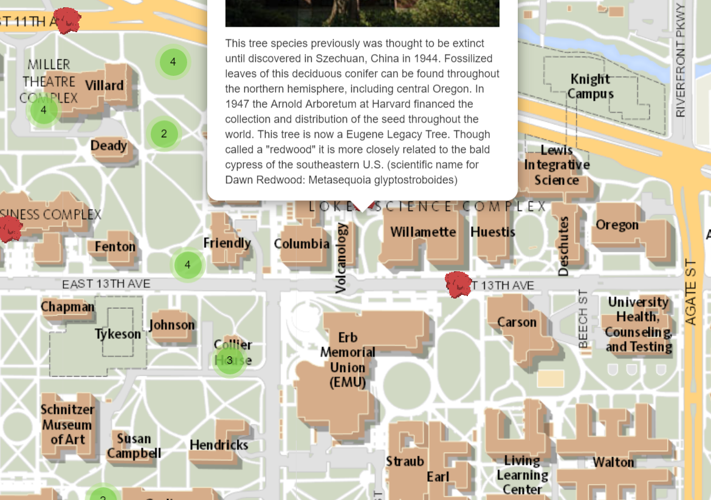

# University of Oregon Tree Map
A Leaflet map using Google Sheets as data repo and hosted on GitHub.

## Live links
- Leaflet Map https://NolanCassidy.github.io/Tree-Map-UO
- Google Sheets https://docs.google.com/spreadsheets/d/1q4BuUA63Eg3Z612C0Uu7ek99Mg2DqnaI4N6F6lyUEKs/edit#gid=0

## Credits (and licenses)
Developed by Nolan Cassidy, Zach Domke, Brendon Kieser, Alex Petzold, Cole Sabin, using Google sheets and these open-source components in addition to the new note module created by the developers mentioned above:
- https://github.com/DataVizForAll/leaflet-storymaps-with-google-sheets Developed by Ilya Ilyankou and Jack Dougherty with support from Trinity College CT, using a Google Sheets template (MIT)
- Inspired by: Code for Atlanta mapsfor.us (2016) https://github.com/codeforatlanta/mapsforus (BSD-3-Clause)
- Leaflet v1.0.3 https://leafletjs.com (BSD-2-Clause)
- jQuery v3.2.0 https://code.jquery.com (MIT)
- leaflet-providers (v1.1.15, manually updated for Carto https) https://github.com/leaflet-extras/leaflet-providers (BSD-2-Clause)
- leaflet-locatecontrol (v0.60.0) https://github.com/domoritz/leaflet-locatecontrol (MIT)
- Leaflet.markercluster (v1.0.4) https://github.com/Leaflet/Leaflet.markercluster (MIT)
- Leaflet.MarkerCluster.LayerSupport (v.1.0.3) https://github.com/ghybs/Leaflet.MarkerCluster.LayerSupport (MIT)
- Font Awesome (v4.7) https://cdn.fontawesome.com (MIT, SIL OFL 1.1)
- Leaflet.awesome-markers (v2.0.4) https://github.com/sigma-geosistemas/Leaflet.awesome-markers (MIT)
- Single Element CSS Spinner (31 May 2016) https://github.com/lukehaas/css-loaders (MIT)
- Tabletop.js gives spreadsheets legs, by returning Google Sheets data in JSON format (v1.5.1) https://github.com/jsoma/tabletop (MIT)
- Google Sheets Geocoder (v1.0) by Ilya Ilyankou and Jack Dougherty https://github.com/jackdougherty/google-sheets-geocoder (no license)
- jQuery-CSV (v0.71) https://github.com/evanplaice/jquery-csv (MIT)
- DataTables (v1.10.13) by SpryMedia Ltd. https://datatables.net (MIT)
- [Leaflet Control Geocoder](https://github.com/perliedman/leaflet-control-geocoder) by @perliedman (BSD 2-Clause)
